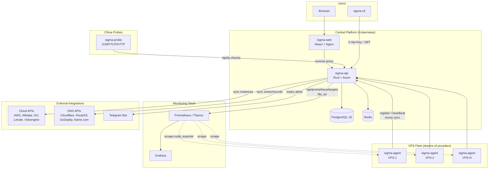

# Σ Sigma

Lightweight VPS fleet management platform for high-turnover VPN infrastructure. Track instances across dozens of small cloud providers, manage IP addresses with carrier labels, and integrate with Prometheus/Grafana for monitoring.

## Architecture



## Features

### Fleet Management
- **Provider management** — Track cloud platforms with ratings and notes
- **VPS lifecycle** — Provisioning → Active → Retiring → Retired → Deleted, with soft delete and restore
- **Multi-IP with labels** — Each VPS has multiple IPs labeled by carrier (china-telecom/unicom/mobile/cernet/overseas/internal/anycast)
- **IP change history** — Auto-tracked via PostgreSQL trigger across all code paths (manual, agent, cloud sync, import)
- **Filtering & search** — By status, country, provider, purpose, tags, expiring within N days
- **Bulk import/export** — CSV and JSON
- **Duplicate detection** — Find and merge duplicate VPS records
- **Cost tracking** — Per provider/country/month with multi-currency support

### Cloud Integration
- **Multi-cloud sync** — AWS, Alibaba Cloud, DigitalOcean, Linode, Volcengine — store credentials, auto-sync instances to VPS table
- **DNS management** — Cloudflare, Route 53, GoDaddy, Name.com — read-only sync with VPS-IP linking, domain/cert expiry tracking
- **Envoy control plane** — xDS server (LDS/CDS) in sigma-agent, routes stored in PostgreSQL, static config sync from `envoy.yaml`

### VPS Agent (sigma-agent)
- **Auto-registration & heartbeat** — System info (CPU, RAM, disk, uptime, load avg), IP discovery
- **Port scanning** — Detect port usage by process, Prometheus `/metrics` endpoint
- **Port allocation** — Find N available ports, proxied via API
- **eBPF monitoring** — TCP retransmit, UDP traffic, RTT/latency, packet drops, DNS query tracing, connection latency, OOM kill tracking, exec tracing (intrusion detection)
- **Envoy integration** — gRPC xDS server + static config sync

### Monitoring & Observability
- **Prometheus file_sd** — Auto-generate targets with rich labels for Thanos/Prometheus/Grafana
- **IP reachability probing** — ICMP/TCP/HTTP checks from China nodes (sigma-probe)
- **Grafana dashboards** — Port scan metrics, fleet overview
- **Telegram/webhook alerts** — Expiring VPS notifications

### Security & Access Control
- **JWT + API Key auth** — Email/password login with JWT, DB-managed API keys with per-key roles
- **RBAC** — Four roles: `admin`, `operator`, `agent`, `readonly` ([details](docs/api-authentication.en.md))
- **TOTP MFA** — Two-factor authentication with Google Authenticator / Authy
- **Rate limiting** — Redis-based sliding window, per-IP
- **Audit log** — Tracks all mutations with user, action, resource, and details
- **Per-agent API keys** — Each VPS gets its own key with least-privilege `agent` role

### Additional
- **Ticket system** — Issue tracking with status workflow, comments, priority, VPS/provider links
- **Ansible inventory** — Dynamic inventory output (`GET /api/ansible/inventory`)
- **OpenAPI/Swagger** — Auto-generated spec at `/swagger-ui`
- **CLI client** — `sigma-cli` (Rust, clap + reqwest)

## Tech Stack

| Layer | Stack |
|-------|-------|
| Backend | Rust 1.88+, Axum 0.8, SQLx 0.8, PostgreSQL 16, Redis |
| Frontend | React 19, Vite 7, TypeScript, Tailwind CSS v4, React Query v5, Recharts |
| Agent | Rust, eBPF (aya), gRPC (tonic), Envoy xDS |
| Infra | Docker Compose (dev), Kubernetes + ArgoCD (prod), GitHub Actions (CI) |

## Quick Start

```bash
# Clone and configure
git clone https://github.com/lai3d/sigma.git
cd sigma
cp .env.example .env

# Start all services
docker compose up -d
```

| Service | URL |
|---------|-----|
| Web UI | http://localhost |
| API | http://localhost:3000/api |
| Swagger UI | http://localhost:3000/swagger-ui |
| PostgreSQL | localhost:5432 |

Default admin login: `admin@sigma.local` / `changeme` (force password change on first login).

## Project Structure

```
sigma/
├── sigma-api/              # Rust backend (Axum + SQLx + PostgreSQL)
├── sigma-web/              # React frontend (Vite + TypeScript + Tailwind CSS)
├── sigma-cli/              # Rust CLI client (clap + reqwest)
├── sigma-probe/            # IP reachability probe (China nodes)
├── sigma-agent/            # VPS agent (heartbeat + eBPF + Envoy xDS)
├── sigma-agent-ebpf/       # eBPF programs (aya)
├── sigma-agent-ebpf-common/# Shared eBPF types
├── grafana/                # Grafana dashboard JSON
├── k8s/                    # Kubernetes manifests (ArgoCD-managed)
├── docs/                   # Documentation (auth guide, architecture)
├── .github/workflows/      # CI: build & push images to GHCR
├── docker-compose.yml      # Local dev orchestration
├── Makefile                # Common commands (make help)
└── DEPLOYMENT.md           # Deployment guide
```

## Make Commands

```bash
make help          # Show all available commands
make dev           # Start dev environment
make logs          # Tail all logs
make logs-api      # Tail API logs
make db-shell      # Open PostgreSQL shell
make db-backup     # Backup database
make test          # Run all tests
make test-api      # Run backend tests
make test-web      # Run frontend tests
```

## API Overview

### Authentication

Two auth methods: JWT (`Authorization: Bearer <token>`) and API Key (`X-Api-Key` header). API keys are DB-managed with per-key roles. See [API Authentication Guide](docs/api-authentication.en.md) for details.

### Key Endpoints

| Category | Method | Path | Description |
|----------|--------|------|-------------|
| **Stats** | GET | `/api/stats` | Dashboard summary |
| **Providers** | GET/POST | `/api/providers` | List / Create |
| | GET/PUT/DELETE | `/api/providers/{id}` | Get / Update / Delete |
| **VPS** | GET/POST | `/api/vps` | List (with filters) / Create |
| | GET/PUT/DELETE | `/api/vps/{id}` | Get / Update / Delete |
| | POST | `/api/vps/{id}/retire` | Quick retire |
| | GET | `/api/vps/{id}/ip-history` | IP change history |
| **Cloud** | GET/POST | `/api/cloud-accounts` | Cloud account CRUD |
| | POST | `/api/cloud-accounts/{id}/sync` | Sync instances from cloud |
| **DNS** | GET/POST | `/api/dns-accounts` | DNS account CRUD |
| | GET | `/api/dns-zones` | Synced zones with expiry |
| | GET | `/api/dns-records` | Synced records with VPS links |
| **Envoy** | GET/POST | `/api/envoy-nodes` | Envoy node management |
| | GET/POST | `/api/envoy-routes` | Route management |
| | POST | `/api/envoy-routes/sync-static` | Sync from envoy.yaml |
| **Agent** | POST | `/api/agent/register` | Agent self-registration |
| | POST | `/api/agent/heartbeat` | Heartbeat with system info |
| **IP Checks** | GET/POST | `/api/ip-checks` | Reachability check results |
| **Tickets** | GET/POST | `/api/tickets` | Issue tracking |
| **Costs** | GET | `/api/costs/summary` | Cost breakdown |
| | GET | `/api/costs/monthly` | Monthly trends |
| **Auth** | POST | `/api/auth/login` | Login (JWT) |
| | GET/POST | `/api/api-keys` | API key management (admin) |
| **Users** | GET/POST | `/api/users` | User management (admin) |
| **Audit** | GET | `/api/audit-logs` | Audit trail (admin) |
| **Infra** | GET | `/api/prometheus/targets` | Prometheus file_sd |
| | GET | `/api/ansible/inventory` | Ansible dynamic inventory |

Full interactive docs at `/swagger-ui`.

### VPS Filters (query params)

`status`, `country`, `provider_id`, `purpose`, `tag`, `expiring_within_days`, `source`, `cloud_account_id`

### Example

```bash
# Login
TOKEN=$(curl -s -X POST http://localhost:3000/api/auth/login \
  -H "Content-Type: application/json" \
  -d '{"email":"admin@sigma.local","password":"changeme"}' | jq -r .token)

# Create a provider
curl -X POST http://localhost:3000/api/providers \
  -H "Authorization: Bearer $TOKEN" \
  -H "Content-Type: application/json" \
  -d '{"name": "Acme Cloud", "country": "US", "website": "https://example.com", "rating": 4}'

# Create a VPS with labeled IPs
curl -X POST http://localhost:3000/api/vps \
  -H "Authorization: Bearer $TOKEN" \
  -H "Content-Type: application/json" \
  -d '{
    "hostname": "hk-relay-01",
    "provider_id": "<uuid>",
    "ip_addresses": [
      {"ip": "103.1.2.3", "label": "china-telecom"},
      {"ip": "10.0.0.1", "label": "internal"}
    ],
    "country": "HK",
    "status": "active",
    "purpose": "vpn-relay",
    "tags": ["optimized", "premium"]
  }'

# List active VPS expiring within 7 days
curl -H "Authorization: Bearer $TOKEN" \
  "http://localhost:3000/api/vps?status=active&expiring_within_days=7"

# Create an agent API key
curl -X POST http://localhost:3000/api/api-keys \
  -H "Authorization: Bearer $TOKEN" \
  -H "Content-Type: application/json" \
  -d '{"name": "agent-hk-relay-01", "role": "agent"}'
```

## Documentation

- [API Authentication & API Key Management (EN)](docs/api-authentication.en.md)
- [API Authentication & API Key Management (ZH)](docs/api-authentication.zh.md)
- [Deployment Guide](DEPLOYMENT.md)

## Deployment

- **Local/Dev**: `docker compose up -d`
- **Production**: Kubernetes via ArgoCD (GitOps, pull-based)
- **CI**: GitHub Actions builds and pushes images to `ghcr.io/lai3d/sigma/{api,web,agent,probe}`

See [DEPLOYMENT.md](DEPLOYMENT.md) for full guide including ArgoCD setup.

## License

MIT
