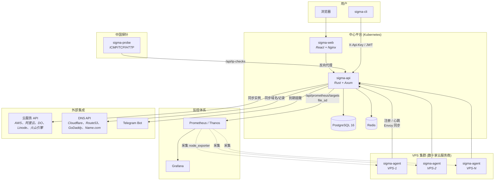

# Σ Sigma

轻量级 VPS 集群管理平台，专为高周转率的 VPN 基础设施设计。管理分布在数十家小型云服务商的 VPS 实例，支持运营商标签化 IP 管理，集成 Prometheus/Grafana 监控体系。

## 架构



## 功能

### 集群管理
- **服务商管理** — 记录云平台信息、评分和备注
- **VPS 生命周期** — 开通中 → 活跃 → 退役中 → 已退役 → 已删除，支持软删除与恢复
- **多 IP 运营商标签** — 每台 VPS 可配置多个 IP，按运营商标记（电信/联通/移动/教育网/海外/内网/Anycast）
- **IP 变更历史** — 通过 PostgreSQL 触发器自动追踪所有代码路径的 IP 变更（手动、Agent、云同步、导入）
- **灵活过滤** — 按状态、国家、服务商、用途、标签、即将到期天数筛选
- **批量导入/导出** — 支持 CSV 和 JSON
- **重复检测** — 发现并合并重复的 VPS 记录
- **费用追踪** — 按服务商/国家/月份统计，支持多币种

### 云集成
- **多云同步** — AWS、阿里云、DigitalOcean、Linode、火山引擎 — 存储凭据，自动同步实例到 VPS 表
- **DNS 管理** — Cloudflare、Route 53、GoDaddy、Name.com — 只读同步，自动关联 VPS IP，域名/证书到期追踪
- **Envoy 控制面** — sigma-agent 内置 xDS 服务器（LDS/CDS），路由存储在 PostgreSQL，支持从 `envoy.yaml` 同步静态配置

### VPS Agent (sigma-agent)
- **自动注册与心跳** — 上报系统信息（CPU、内存、磁盘、运行时间、负载）、IP 发现
- **端口扫描** — 检测各进程端口占用，提供 Prometheus `/metrics` 端点
- **端口分配** — 查找 N 个可用端口，通过 API 代理调用
- **eBPF 监控** — TCP 重传、UDP 流量、RTT/延迟、丢包、DNS 查询追踪、连接延迟、OOM Kill 追踪、exec 追踪（入侵检测）
- **Envoy 集成** — gRPC xDS 服务器 + 静态配置同步

### 监控与可观测性
- **Prometheus file_sd** — 自动生成带丰富标签的监控目标，对接 Thanos/Prometheus/Grafana
- **IP 可达性探测** — 从中国节点发起 ICMP/TCP/HTTP 检测（sigma-probe）
- **Grafana 仪表盘** — 端口扫描指标、集群概览
- **Telegram/Webhook 告警** — VPS 到期提醒

### 安全与访问控制
- **JWT + API Key 认证** — 邮箱/密码登录获取 JWT，数据库管理的 API Key 支持独立角色
- **RBAC** — 四种角色：`admin`、`operator`、`agent`、`readonly`（[详情](docs/api-authentication.zh.md)）
- **TOTP 双因素认证** — 支持 Google Authenticator / Authy
- **速率限制** — 基于 Redis 的滑动窗口，按 IP 限流
- **审计日志** — 记录所有变更操作的用户、动作、资源和详情
- **Agent 独立密钥** — 每台 VPS 使用独立的最小权限 `agent` 角色 API Key

### 其他
- **工单系统** — 问题追踪，支持状态流转、评论、优先级、关联 VPS/服务商
- **Ansible 动态 Inventory** — `GET /api/ansible/inventory`
- **OpenAPI/Swagger** — 自动生成的 API 文档，访问 `/swagger-ui`
- **CLI 客户端** — `sigma-cli`（Rust，clap + reqwest）

## 技术栈

| 层级 | 技术 |
|------|------|
| 后端 | Rust 1.88+、Axum 0.8、SQLx 0.8、PostgreSQL 16、Redis |
| 前端 | React 19、Vite 7、TypeScript、Tailwind CSS v4、React Query v5、Recharts |
| Agent | Rust、eBPF (aya)、gRPC (tonic)、Envoy xDS |
| 基础设施 | Docker Compose（开发）、Kubernetes + ArgoCD（生产）、GitHub Actions（CI） |

## 快速开始

```bash
# 克隆并配置
git clone https://github.com/lai3d/sigma.git
cd sigma
cp .env.example .env

# 启动所有服务
docker compose up -d
```

| 服务 | 地址 |
|------|------|
| Web 界面 | http://localhost |
| API | http://localhost:3000/api |
| Swagger UI | http://localhost:3000/swagger-ui |
| PostgreSQL | localhost:5432 |

默认管理员账号：`admin@sigma.local` / `changeme`（首次登录强制修改密码）。

## 项目结构

```
sigma/
├── sigma-api/              # Rust 后端（Axum + SQLx + PostgreSQL）
├── sigma-web/              # React 前端（Vite + TypeScript + Tailwind CSS）
├── sigma-cli/              # Rust CLI 客户端（clap + reqwest）
├── sigma-probe/            # IP 可达性探针（部署在中国节点）
├── sigma-agent/            # VPS Agent（心跳 + eBPF + Envoy xDS）
├── sigma-agent-ebpf/       # eBPF 程序（aya）
├── sigma-agent-ebpf-common/# eBPF 共享类型
├── grafana/                # Grafana 仪表盘 JSON
├── k8s/                    # Kubernetes 部署清单（ArgoCD 管理）
├── docs/                   # 文档（认证指南、架构说明）
├── .github/workflows/      # CI：构建并推送镜像到 GHCR
├── docker-compose.yml      # 本地开发编排
├── Makefile                # 常用命令（make help）
└── DEPLOYMENT.md           # 部署指南
```

## 常用命令

```bash
make help          # 显示所有可用命令
make dev           # 启动开发环境
make logs          # 查看所有服务日志
make logs-api      # 查看 API 日志
make db-shell      # 打开 PostgreSQL 终端
make db-backup     # 备份数据库
make test          # 运行所有测试
make test-api      # 运行后端测试
make test-web      # 运行前端测试
```

## API 概览

### 认证

支持两种认证方式：JWT（`Authorization: Bearer <token>`）和 API Key（`X-Api-Key` 请求头）。API Key 通过数据库管理，每个 Key 有独立角色。详见 [API 认证与 API Key 管理](docs/api-authentication.zh.md)。

### 主要端点

| 分类 | 方法 | 路径 | 说明 |
|------|------|------|------|
| **统计** | GET | `/api/stats` | 仪表盘概览 |
| **服务商** | GET/POST | `/api/providers` | 列表 / 创建 |
| | GET/PUT/DELETE | `/api/providers/{id}` | 查询 / 更新 / 删除 |
| **VPS** | GET/POST | `/api/vps` | 列表（支持过滤）/ 创建 |
| | GET/PUT/DELETE | `/api/vps/{id}` | 查询 / 更新 / 删除 |
| | POST | `/api/vps/{id}/retire` | 快速退役 |
| | GET | `/api/vps/{id}/ip-history` | IP 变更历史 |
| **云账号** | GET/POST | `/api/cloud-accounts` | 云账号增删改查 |
| | POST | `/api/cloud-accounts/{id}/sync` | 从云端同步实例 |
| **DNS** | GET/POST | `/api/dns-accounts` | DNS 账号增删改查 |
| | GET | `/api/dns-zones` | 已同步的域名区域 |
| | GET | `/api/dns-records` | DNS 记录（自动关联 VPS） |
| **Envoy** | GET/POST | `/api/envoy-nodes` | Envoy 节点管理 |
| | GET/POST | `/api/envoy-routes` | 路由管理 |
| | POST | `/api/envoy-routes/sync-static` | 从 envoy.yaml 同步 |
| **Agent** | POST | `/api/agent/register` | Agent 自注册 |
| | POST | `/api/agent/heartbeat` | 心跳上报 |
| **IP 检测** | GET/POST | `/api/ip-checks` | 可达性检测结果 |
| **工单** | GET/POST | `/api/tickets` | 工单管理 |
| **费用** | GET | `/api/costs/summary` | 费用汇总 |
| | GET | `/api/costs/monthly` | 月度趋势 |
| **认证** | POST | `/api/auth/login` | 登录（JWT） |
| | GET/POST | `/api/api-keys` | API Key 管理（管理员） |
| **用户** | GET/POST | `/api/users` | 用户管理（管理员） |
| **审计** | GET | `/api/audit-logs` | 审计日志（管理员） |
| **集成** | GET | `/api/prometheus/targets` | Prometheus file_sd |
| | GET | `/api/ansible/inventory` | Ansible 动态 Inventory |

完整交互式文档请访问 `/swagger-ui`。

### VPS 过滤参数

`status`、`country`、`provider_id`、`purpose`、`tag`、`expiring_within_days`、`source`、`cloud_account_id`

### 示例

```bash
# 登录
TOKEN=$(curl -s -X POST http://localhost:3000/api/auth/login \
  -H "Content-Type: application/json" \
  -d '{"email":"admin@sigma.local","password":"changeme"}' | jq -r .token)

# 创建服务商
curl -X POST http://localhost:3000/api/providers \
  -H "Authorization: Bearer $TOKEN" \
  -H "Content-Type: application/json" \
  -d '{"name": "Acme Cloud", "country": "US", "website": "https://example.com", "rating": 4}'

# 创建带运营商标签 IP 的 VPS
curl -X POST http://localhost:3000/api/vps \
  -H "Authorization: Bearer $TOKEN" \
  -H "Content-Type: application/json" \
  -d '{
    "hostname": "hk-relay-01",
    "provider_id": "<uuid>",
    "ip_addresses": [
      {"ip": "103.1.2.3", "label": "china-telecom"},
      {"ip": "10.0.0.1", "label": "internal"}
    ],
    "country": "HK",
    "status": "active",
    "purpose": "vpn-relay",
    "tags": ["optimized", "premium"]
  }'

# 查询 7 天内到期的活跃 VPS
curl -H "Authorization: Bearer $TOKEN" \
  "http://localhost:3000/api/vps?status=active&expiring_within_days=7"

# 为 Agent 创建专属 API Key
curl -X POST http://localhost:3000/api/api-keys \
  -H "Authorization: Bearer $TOKEN" \
  -H "Content-Type: application/json" \
  -d '{"name": "agent-hk-relay-01", "role": "agent"}'
```

## 文档

- [API 认证与 API Key 管理](docs/api-authentication.zh.md)
- [部署指南](DEPLOYMENT.md)

## 部署

- **本地/开发**：`docker compose up -d`
- **生产环境**：Kubernetes + ArgoCD（GitOps，拉取式部署）
- **CI**：GitHub Actions 自动构建并推送镜像到 `ghcr.io/lai3d/sigma/{api,web,agent,probe}`

详见 [DEPLOYMENT.md](DEPLOYMENT.md)。

## 许可证

MIT
