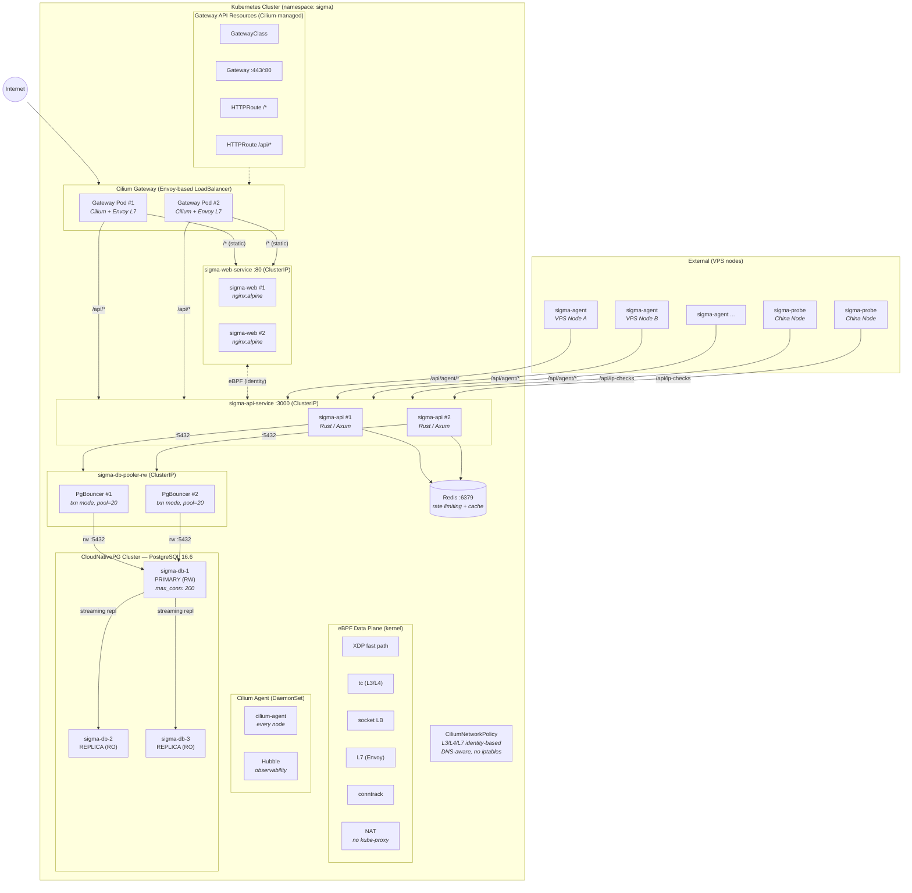

# Sigma K8s Architecture — Cilium Gateway

Cilium — eBPF-powered CNI + Gateway API + Network Policy + Hubble observability, all in one



## Cilium Advantages

- **eBPF** — no iptables, no kube-proxy
- **CNI + Gateway + Policy unified** — single platform
- **Gateway API (native)** — first-class support
- **Identity-based network policy** — L3/L4/L7 with DNS-aware rules
- **Hubble flow observability** — real-time traffic visibility
- **WireGuard encryption** — optional transparent encryption
- **No sidecar overhead** — kernel-level networking
- **Bandwidth Manager (EDT)** — fair queuing
- **Sigma synergy** — both sigma-agent and Cilium use eBPF
- **XDP DDoS mitigation** — kernel bypass for fast-path drops

## Connection Flow

```
Internet → Cilium Gateway (eBPF + Envoy L7)
  ├─ /* (static)  → eBPF socket LB → sigma-web Pod
  └─ /api/*       → eBPF socket LB → sigma-api Pod
                      ├─ Redis (rate limiting)
                      └─ PgBouncer (pooled)
                           └─ PG Primary (200 max)
```
