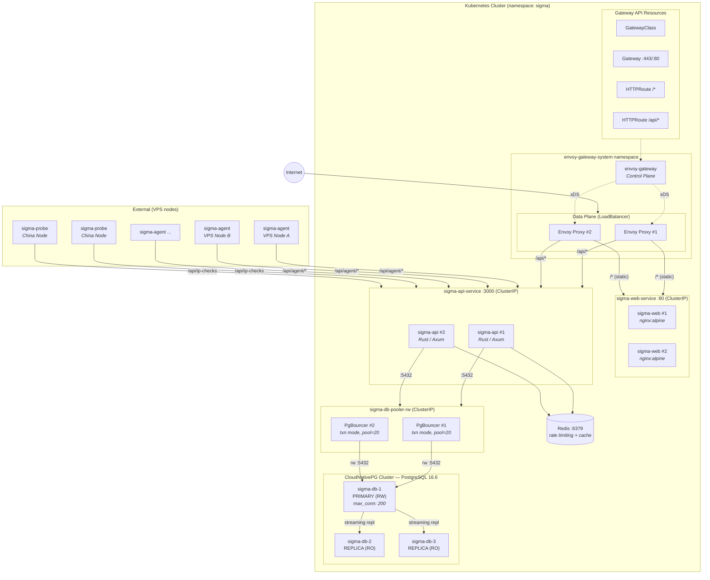

# Sigma K8s Architecture — Envoy Gateway

Gateway API (GatewayClass + Gateway + HTTPRoute) — Envoy as data plane, unified with sigma-agent xDS stack



## Why Envoy Gateway?

- **Gateway API (GA)** — standard Kubernetes API for traffic management
- **Envoy data plane** — high-performance L7 proxy
- **TLS via cert-manager** — automatic certificate management
- **Rate limit built-in** — native rate limiting support
- **WASM extensibility** — extend with WebAssembly filters
- **sigma-agent xDS + EG = all Envoy stack** — unified Envoy ecosystem

## Connection Flow

```
Internet → Envoy Proxy (L7)
  ├─ /* (static)  → sigma-web Pod
  └─ /api/*       → sigma-api Pod
                      ├─ Redis (rate limiting)
                      └─ PgBouncer (pooled)
                           └─ PG Primary (200 max)
```
