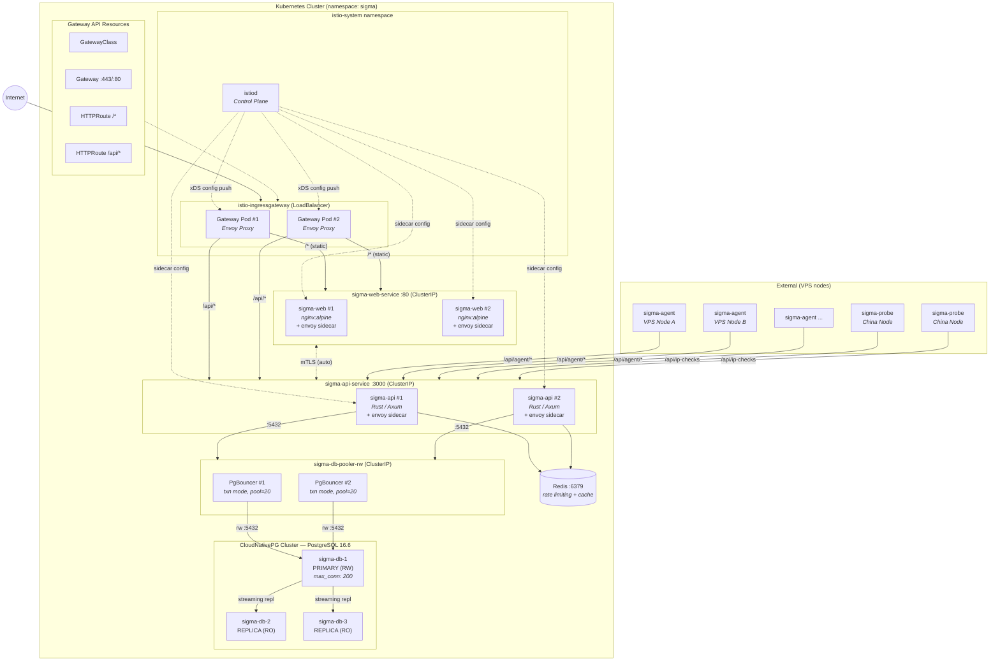

# Sigma K8s Architecture — Istio Ingress Gateway

Istio Service Mesh + Gateway API — Envoy sidecar proxies, mTLS, observability built-in



## Istio Mesh Benefits

- **mTLS everywhere** — automatic mutual TLS between all pods
- **Sidecar auto-inject** — envoy sidecar injected into every pod
- **L7 traffic policies** — fine-grained routing and retries
- **Distributed tracing** — Jaeger / Zipkin integration
- **Metrics** — Kiali service mesh dashboard
- **Circuit breaking** — protect downstream services
- **Canary / traffic split** — progressive rollouts
- **Full Envoy stack** — gateway + sidecar + sigma-agent xDS

## Connection Flow

```
Internet → Istio Gateway (Envoy L7)
  ├─ /* (static)  → envoy sidecar → sigma-web Pod
  └─ /api/*       → envoy sidecar → sigma-api Pod
                      ├─ Redis (rate limiting)
                      └─ PgBouncer (pooled)
                           └─ PG Primary (200 max)
```
