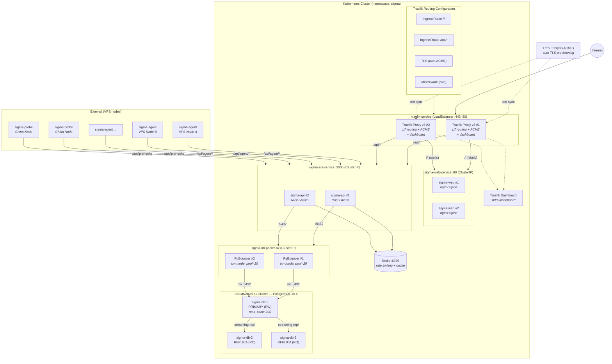

# Sigma K8s Architecture — Traefik

Traefik Proxy — Cloud-native edge router with automatic HTTPS, dashboard, and Gateway API support



## Traefik Features

- **Auto HTTPS** — Let's Encrypt ACME (HTTP-01 / DNS-01)
- **IngressRoute CRD** — more expressive than annotations
- **Gateway API support (v3)** — standard K8s routing
- **Built-in dashboard :8080** — routers, services, middlewares
- **Middleware chains** — rate-limit, auth, headers, redirect
- **Canary / weighted round-robin** — progressive rollouts
- **Metrics (Prometheus)** — built-in metrics exporter
- **TCP/UDP routing** — SSH, DNS, etc.
- **K3s default ingress** — lightweight, single binary

## Considerations

- No service mesh / mTLS (ingress only)
- Advanced features require Traefik Enterprise
- Less raw performance vs Envoy at very high RPS
- CRD sprawl (IngressRoute, Middleware, TLSOption...)
- No sidecar model — edge-only proxy

## Connection Flow

```
Internet → Traefik Proxy (L7 + TLS)
  ├─ /* (static)  → ClusterIP → sigma-web Pod
  └─ /api/*       → ClusterIP → sigma-api Pod
                      ├─ Redis (rate limiting)
                      └─ PgBouncer (pooled)
                           └─ PG Primary (200 max)
```
