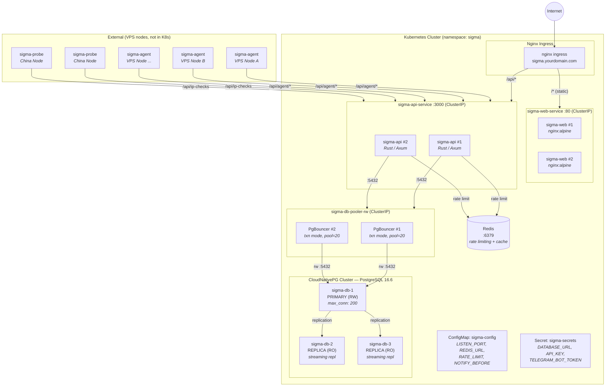

# Sigma K8s Deployment Architecture

Nginx Ingress + CloudNativePG HA + PgBouncer Pool + Multi-Replica Services



## Connection Flow

```
Internet → Nginx Ingress (L7)
  ├─ /* (static)  → sigma-web Pods (nginx:alpine)
  └─ /api/*       → sigma-api Pods (Rust/Axum)
                      ├─ Redis (rate limiting)
                      └─ PgBouncer (pool=20, txn mode)
                           └─ PostgreSQL Primary (max_conn=200)
                                ├─ Replica #2 (streaming)
                                └─ Replica #3 (streaming)

External:
  sigma-agent (VPS A, B, ...) → /api/agent/heartbeat, /api/agent/register
  sigma-probe (China nodes)   → /api/ip-checks
```

## Key Specs

| Component | Replicas | Resources |
|-----------|----------|-----------|
| sigma-web | 2 | nginx:alpine |
| sigma-api | 2 | Rust / Axum |
| PgBouncer | 2 | max_client_conn=100, pool=20 |
| PostgreSQL | 1 primary + 2 replicas | 10Gi PVC each, max_conn=200, shared_buf=256MB |
| Redis | 1 | rate limiting + cache |
